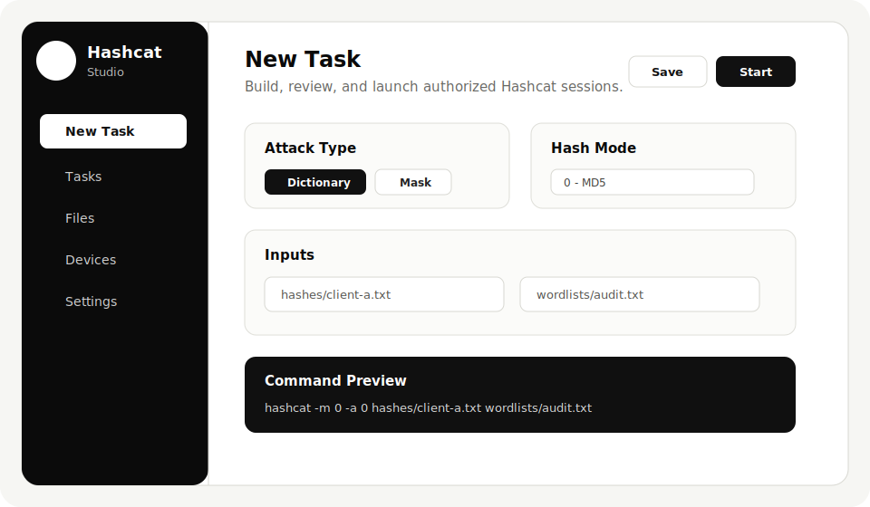

<p align="center">
  
</p>

<h1 align="center">Hashcat Studio</h1>

<p align="center">
  A clean desktop GUI for authorized Hashcat work.
</p>

<p align="center">
  <a href="https://github.com/B60-0/hashcat-studio/releases/latest"></a>
  <a href="https://github.com/B60-0/hashcat-studio/actions"></a>
  <a href="LICENSE"></a>
</p>

<p align="center">
  <a href="https://github.com/B60-0/hashcat-studio/releases/latest"><strong>Download</strong></a>
  ·
  <a href="docs/wiki/Home.md"><strong>Docs</strong></a>
  ·
  <a href="CONTRIBUTING.md"><strong>Contribute</strong></a>
  ·
  <a href="SECURITY.md"><strong>Security</strong></a>
</p>

<br>

<p align="center">
  
</p>

<br>

> Hashcat Studio can use your existing Hashcat install or download the latest official Hashcat release during first-run setup.

> Use this only for systems, hashes, and audits you are allowed to test.

## At A Glance

| Build Tasks | Preview Commands | Watch Output |
| --- | --- | --- |
| Create dictionary and mask attacks without hand-writing every flag. | See the generated Hashcat command before it runs. | Follow stdout, stderr, status, and task state from the app. |

| Manage Files | Choose Devices | Stay Local |
| --- | --- | --- |
| Keep hashes, wordlists, rules, masks, and outputs organized. | Load device info and benchmark supported hash modes. | Runs your installed Hashcat binary on your machine. |

## Install

Download the latest build from [GitHub Releases](https://github.com/B60-0/hashcat-studio/releases/latest).

| Platform | What to download | Hashcat setup |
| --- | --- | --- |
| macOS | `Hashcat-Studio-macOS-*.dmg` | Open the DMG and drag Hashcat Studio into Applications |
| Windows | `Hashcat-Studio-Windows-*.zip` | Use setup or choose an existing `hashcat.exe` |
| Linux | `Hashcat-Studio-Linux-*.tar.gz` | Use setup, choose an existing install, or use your package manager |

On first launch, Hashcat Studio opens a setup flow. You can download Hashcat from inside the app, choose a Hashcat folder, choose a single binary, or use `hashcat` from your PATH.

Common paths:

```text
macOS Apple Silicon: /opt/homebrew/bin/hashcat
macOS Intel:         /usr/local/bin/hashcat
Linux:               /usr/bin/hashcat
Windows:             C:\path\to\hashcat.exe
```

## First Run

1. Download Hashcat Studio for your OS.
2. Open the app.
3. Pick **Download Hashcat**, **Choose Folder**, **Choose Binary**, or **Use `hashcat` from PATH**.
4. Let setup validate Hashcat.
5. Add your hash and wordlist files.
6. Create a task and preview the command.
7. Start the task when everything looks right.

<br>

## Features

| Tasks | Files | Hashcat |
| --- | --- | --- |
| Dictionary attacks | Hash folders | Binary validation |
| Mask attacks | Wordlist folders | Algorithm loading |
| Live logs | Rule folders | Device info |
| Pause and resume | Mask folders | Benchmarks |
| Checkpoint and skip | Output folders | Command previews |

<br>

<details>
<summary><strong>Build from source</strong></summary>

<br>

Requirements:

| Tool | Version |
| --- | --- |
| Go | 1.22+ |
| Node.js | 20+ |
| Wails CLI | 2.12.0 |
| Hashcat | Your local install |

Install Wails:

```bash
go install github.com/wailsapp/wails/v2/cmd/wails@v2.12.0
```

Build the app:

```bash
npm --prefix frontend install
npm --prefix frontend run build
go test ./internal/...
wails build
```

The desktop binary is written to `build/bin/`.

</details>

<details>
<summary><strong>macOS signing and notarization</strong></summary>

<br>

Unsigned macOS builds require users to override Gatekeeper. To ship a DMG that opens normally, enroll in the Apple Developer Program, create a Developer ID Application certificate, and configure these GitHub Actions secrets before creating a `v*` release tag:

| Secret | Value |
| --- | --- |
| `MACOS_CERTIFICATE_P12` | Base64-encoded Developer ID Application `.p12` certificate |
| `MACOS_CERTIFICATE_PASSWORD` | Password for that `.p12` export |
| `MACOS_CODESIGN_IDENTITY` | Full signing identity, for example `Developer ID Application: Name (TEAMID)` |
| `APPLE_ID` | Apple ID used for notarization |
| `APPLE_TEAM_ID` | Apple Developer Team ID |
| `APPLE_APP_SPECIFIC_PASSWORD` | App-specific password for the Apple ID |

Create the base64 certificate value on macOS:

```bash
base64 -i DeveloperIDApplication.p12 | pbcopy
```

When all secrets are present, the release workflow signs the app with hardened runtime, notarizes the macOS DMG with Apple, staples the notarization ticket, and uploads the notarized DMG.

</details>

<details>
<summary><strong>Development</strong></summary>

<br>

Start the app in development mode:

```bash
npm --prefix frontend install
wails dev
```

Useful checks:

```bash
go test ./internal/...
npm --prefix frontend run lint
npm --prefix frontend run build
```

</details>

<details>
<summary><strong>Project layout</strong></summary>

<br>

```text
internal/hashcat   Hashcat argument building and binary helpers
internal/tasks     Task manager and subprocess streaming
internal/assets    Asset folder scanner
internal/settings  App settings and folders
frontend/src       React UI
docs/wiki          GitHub wiki source pages
```

</details>

<br>

## Docs

The wiki pages live in `docs/wiki` so they can be reviewed with the rest of the source:

- [Installation](docs/wiki/Installation.md)
- [First Run](docs/wiki/First-Run.md)
- [Creating Tasks](docs/wiki/Creating-Tasks.md)
- [Files And Folders](docs/wiki/Files-And-Folders.md)
- [Troubleshooting](docs/wiki/Troubleshooting.md)
- [Responsible Use](docs/wiki/Responsible-Use.md)

## License

MIT. See [LICENSE](LICENSE).

Hashcat Studio is not affiliated with the Hashcat project.
